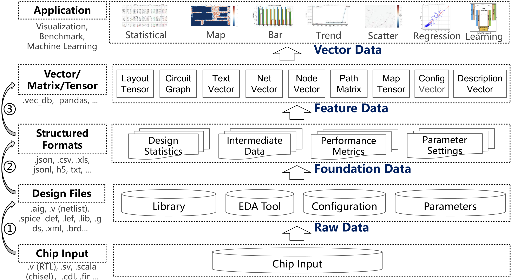
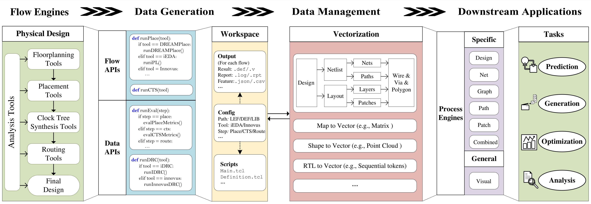

<div align="center">


<h3> An Open-Source AI-Aided Design Library for Design-to-Vector </h3>

<p align="center">
    <a title="GitHub Watchers" target="_blank" href="https://github.com/OSCC-Project/AiEDA/watchers">
        
    </a>
    <a title="GitHub Stars" target="_blank" href="hhttps://github.com/OSCC-Project/AiEDA/stargazers">
        
    </a>
    <a title="GitHub Forks" target="_blank" href="https://github.com/OSCC-Project/AiEDA/network/members">
        
    </a>
</p>

</div>


## Overview

AiEDA is an open-source AI-native Electronic Design Automation (EDA) library that revolutionizes chip design workflows by introducing a unified design-to-vector methodology. Built on the iEDA infrastructure, it transforms diverse chip design data into standardized multi-level vector representations through modular engine integration, comprehensive data extraction frameworks, and hierarchical data management. AiEDA bridges traditional EDA tools with modern AI/ML techniques by providing complete physical design flows, programmatic data extraction capabilities, and standardized Python interfaces, establishing an AI-aided design (AAD) paradigm that enables seamless integration between EDA datasets and AI frameworks. 


<div align="center">

<h3> Data Transformation for AI-aided design (AAD) </h3>
</div>


## Software Architecture

AiEDA follows a modular architecture built on top of the iEDA infrastructure:

```
AiEDA Architecture
├── AI Layer (aieda.ai)
│   ├── Net Wirelength Prediction (TabNet)
│   ├── Design Space Exploration (DSE)
│   └── ML Model Training & Inference
├── Analysis Layer (aieda.analysis)
│   ├── Design-level Analysis
│   ├── Net Analysis
│   ├── Path Analysis
│   └── Patch Analysis
├── EDA Integration Layer (aieda.eda)
│   ├── iEDA Tool Wrappers
│   ├── Flow Management
│   └── Data Extraction
├── Data Management Layer (aieda.data)
│   ├── Database Structures
│   ├── Vector Generation
│   └── Feature Engineering
├── Workspace Management (aieda.workspace)
├── Utilities (aieda.utility)
└── GUI Interface (aieda.gui)
```

## Core Modules

### 1. AI Module (`aieda.ai`)
- **Net Wirelength Prediction**: TabNet-based models for predicting wire lengths
- **Design Space Exploration (DSE)**: Automated parameter optimization
- **Model Training**: Support for various ML frameworks and algorithms

### 2. Analysis Module (`aieda.analysis`)
- **Design Analysis**: Cell type, core usage, pin distribution analysis
- **Net Analysis**: Wire distribution and metrics correlation
- **Path Analysis**: Delay and stage analysis
- **Patch Analysis**: Map analysis, wire density, and feature correlation

### 3. EDA Integration (`aieda.eda`)
- **iEDA Tool Integration**: Wrappers for 11+ EDA tools
  - Placement (iPL)
  - Routing (iRT)
  - Clock Tree Synthesis (iCTS)
  - Static Timing Analysis (iSTA)
  - Floorplanning (iFP)
  - Power Analysis (iPA)
  - Design Rule Checking (iDRC)
  - And more...

### 4. Data Management (`aieda.data`)
- **Database Structures**: Comprehensive data models for EDA features
- **Vector Generation**: Automated feature extraction and vectorization
- **Parameters**: EDA tool parameter management

### 5. Flows (`aieda.flows`)
- **iEDA Flow Management**: Automated execution of EDA tool chains
- **Data Generation**: Automated dataset creation for ML training
- **Flow Configuration**: Flexible flow definition and execution

### 6. Workspace (`aieda.workspace`)
- **Project Management**: Workspace creation and management
- **File Organization**: Structured project directory management

### 7. Utilities (`aieda.utility`)
- **Logging**: Comprehensive logging system
- **JSON Parsing**: Configuration file management
- **Permission Management**: File and folder permission handling

### 8. GUI (`aieda.gui`)
- **Layout Visualization**: Graphical interface for design visualization

## Data Flow

The AiEDA data flow follows this pattern:

1. **Design Input** → Workspace creation with design files
2. **EDA Processing** → iEDA tools process the design through various stages
3. **Feature Extraction** → Data extraction and vectorization from EDA results
4. **AI Analysis** → ML models analyze extracted features
5. **Optimization** → AI-guided parameter optimization and design improvements
6. **Validation** → Results validation and iteration


<div align="center">

<h3> Data Flow </h3>
</div>


```
Design Files → Workspace → EDA Tools → Feature Extraction → AI Models → Analyse → Results
                               ↑                                       ↓
                               └──── Feedback Loop (Optimization) ─────┘
```

## Build Methods

### Method 1: Local Installation (Python dependencies and aieda library)

1. **Clone the repository with submodules:**
   ```bash
   git clone <repository-url>
   cd AiEDA
   git submodule update --init --recursive
   ```

2. **Install Python Dependencies and AiEDA library:**

   We support multiple Python package managers (conda, uv, etc.). We recommend UV for its efficiency.

   ```bash
   # Use the provided build script (recommended)
   # The script builds the AiEDA library by default
   ./build.sh
   # You can also skip the AiEDA library build using --skip-build 
   # (recommended for development)
   ./build.sh --skip-build

   # Or install manually
   # Install UV
   pip install uv
   # Create and activate virtual environment
   uv venv
   source .venv/bin/activate
   # Install aieda using one of the following options:
   # Option 1: Development mode (recommended for development)
   uv pip install -e .
   # Option 2: Regular installation
   uv build
   uv pip install dist/aieda-0.1.0-py3-none-any.whl
   ```

3. **Compile iEDA:**
   ```bash
   mkdir build
   cd build
   cmake ..
   make -j32 ieda_py
   ```
   **Note:** Building ieda_py requires **sudo** privileges to download additional system libraries.

4. **Run Tests:**
   ```bash
   uv run python test/test_sky130_gcd.py
   ```

### Method 2: Docker Build (Complete environment with all dependencies)

Docker provides a containerized environment with all dependencies pre-configured, including Python/C++ dependencies, AiEDA library, and source code.

#### Prerequisites
- Docker installed on your system
- At least 20GB of available disk space (this will be optimized in future versions)

#### Build Steps

1. **Clone the repository with submodules:**
   ```bash
   git clone <repository-url>
   cd AiEDA
   git submodule update --init --recursive
   ```

2. **Build the Docker image:**
   ```bash
   docker build -t aieda:latest .
   ```

3. **Run the container:**
   ```bash
   # Test the installation
   docker run --rm aieda:latest python3 test/test_sky130_gcd.py

   # Run in detached mode for interactive use
   docker run -dit --name myaieda aieda:latest bash
   
   # Enter the running container
   docker exec -it myaieda bash
   ```

**Note:** For detailed Docker instructions, refer to the build script and Dockerfile in the repository.


## Getting Started

### Basic Usage Example

```python
import aieda
from aieda.workspace import workspace_create
from aieda.flows import RunIEDA, DataGeneration
from aieda.analysis import CellTypeAnalyzer
from aieda.ai import TabNetTrainer

# Create workspace
workspace = workspace_create(directory="./my_design", design="gcd")

# Run EDA flow
run_ieda = RunIEDA(workspace)
run_ieda.run_flows()

# Generate training data
data_gen = DataGeneration(workspace)
data_gen.generate_vectors()

# Perform analysis
analyzer = CellTypeAnalyzer()
analyzer.analyze()

# Train AI model
trainer = TabNetTrainer()
trainer.train()
```

### Running Tests

```bash
# Test iEDA backend
python test/test_ieda_flows.py

# Test design-level analysis
python test/test_analysis_design.py

# Test AI model training
python test/test_ai_task_placement.py
```

## Key Features

- **AI-Native Design**: Built from ground up with AI/ML integration
- **Comprehensive EDA Integration**: Support for 11+ EDA tools via iEDA
- **Automated Workflows**: End-to-end automation from design to optimization
- **Extensible Architecture**: Modular design for easy extension and customization
- **Production Ready**: Proven with 4+ successful tape-outs
- **Open Source**: Fully open-source with active community support

## Research and Publications

- **AiEDA2.0: An Open-source AI-Aided Design (AAD) Library for Design-to-Vector**, ISEDA, 2025
- **iEDA: An Open-source infrastructure of EDA**, ASPDAC, 2024
- **iPD: An Open-source intelligent Physical Design Tool Chain**, ASPDAC, 2024

## Contributing

We welcome contributions! Please see our contributing guidelines and feel free to submit issues and pull requests.

## License

This project is open-source. Please refer to the LICENSE file for details.

## Support

For questions and support, please visit our documentation (https://ieda.oscc.cc/en/aieda/library/) and the deepwiki (https://deepwiki.com/OSCC-Project/AiEDA) or contact us (https://ieda.oscc.cc/en/publicity/connection.html)